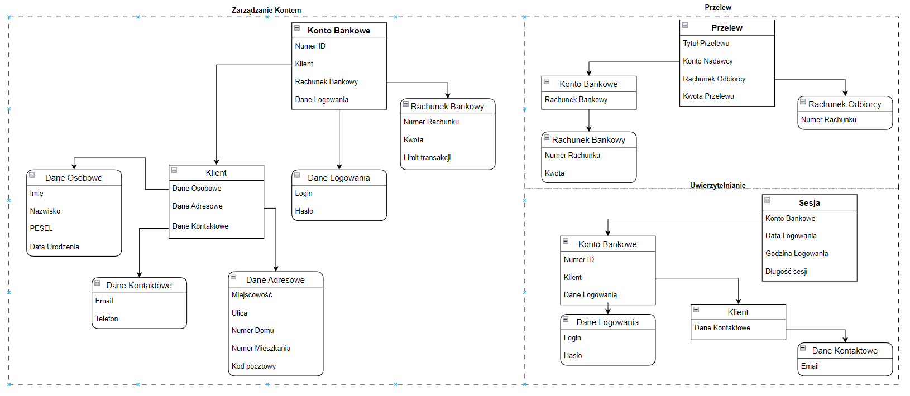

# Zadanie 1

Celem zadania było stworzenie podstawowego modelu bankowości wykorzystując zasady Domain Driven Design. W moim modelu skupiłem się na 3 kontekstach: `Zarządzanie Kontem`, `Przelew` i `Uwierzytelnianie`. Każdy kontekst posiada jeden unikalny agregat (`Root` jest zaznaczony pogrubioną czcionką). Jedna encja jest obecna w więcej niż jednym kontekście, ale informacje w niej zawarte są zależne od kontekstu. Atrybuty każdej encji i obiektu wartości (OV) mają określony format danych oraz jaki zakres wartości mogą prezentować.

## Konteksty

1. Zarządzanie Kontem
2. Przelew
3. Uwierzytelnianie

## Agregracje

1. Konto Bankowe
2. Przelew
3. Sesja 

## Encje

1. Klient
    * Dane Osobowe: OV
    * Dane Adresowe: OV
    * Dane Kontaktowe: OV
2. Konto Bankowe
    * NUMER ID: String - losowy ciąg znaków o określonej długości zatwierdzonej przez administratora, musi być unikalny dla każdego użytkownika.
    * Klient: Encja
    * Rachunek Bankowy: OV
    * Dane Logowania: OV
3. Przelew
    * Tytuł Przelewu: String - Dowolny String ograniczony długością, np. Do 100 znaków.
    * Konto Nadawcy: Encja
    * Rachunek Odbiorcy: OV
    * Kwota Przelewu: Unsigned Long Double - liczba zmiennoprzecinkowa z dwoma miejscami po przecinku, która nie może przekroczyć limitu transakcji dla danego rachunku bankowego i kwoty, która jest obecna na koncie wykonującego przelew
4. Sesja
    * Konto Bankowe: Encja
    * Data Logowania: Data, nie może wybiegać w przyszłość
    * Godzina Logowania: Godzina, nie może wybiegać w przyszłość
    * Długość sesji: Unsigned Int - liczba minut jaka została do zakończenia sesji, restartuje się po wykonaniu akcji.

## Obiekty Wartości (OV)

1. Dane Osobowe
    * Imię: String
    * Nazwisko: String
    * PESEL: String - Ciąg cyfr o długości 11, który spełnia założenia PESELU (cyfry od daty urodzenia i płci).
    * Data Urodzenia: Data - Format daty zaczynający się od 1900 r. nie mogący reprezentować daty przyszłej.
2. Dane Adresowe
    * Miejscowość: String
    * Ulica: String - może być pusta
    * Numer Domu: String - przdstawiona jako numer z opcjonalną literą
    * Numer Mieszkania: String - Opcjonalna zmienna, przdstawiona jako numer z opcjonalną literą
    * Kod pocztowy: String - Ciąg znaków spełniający kryterium polskiego kodu pocztowego (xx-xxx gdzie x to cyfra).
3. Dane Kontaktowe
    * Email: String - Ciąg znaków spełniający kryterium adresu email(dozwolone symbole i wymagany znak `@`).
    * Numer telefonu: Int - Ciąg cyfr składający się z 9 bądź 12 znaków (w tej drugiej opcji użytownik podaje znak `+` i dwie cyfry numeru kierunkowego)
4. Rachunek Bankowy
    * Numer Rachunku - Ciąg znaków składający się z 26 cyfr, musi być unikalny.
    * Kwota: Long Double - Posiada max dwa miejsca po przecinku.
    * Limit Transakcji: Long Int 
5. Dane Logowania
    * Login: String - musi być unikalny
    * Hasło: String - Musi spełniać założenia administratora odnośnie minimalnej długości i obecności znaków specjalnych.
6. Rachunek Odbiorcy
    * Numer Rachunku - Ciąg znaków składający się z 26 cyfr, musi być unikalny.

